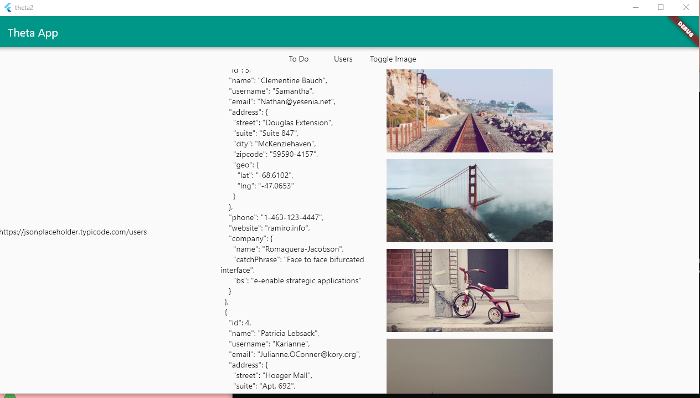

# Theta App



To use the Provider package, you first have to create a Provider class. This class uses ChangeNotifier and 
updates the response with a new value. In this class, I created new variables that can be used throughout the app with Provider. 

```dart
class MainResponseWindow with ChangeNotifier {
  String _responseText = "";
  String get responseText => _responseText;

  void updateResponseWindow(response) {
    _responseText = response;
    notifyListeners();
  }
}
```
Inside of the `main()` function at the top of my code, I had to call my `ChangeNotifierProvider()` and
`create` property.
```dart
void main() {
  runApp(MultiProvider(providers: [
    ChangeNotifierProvider(
      create: (_) => MainResponseWindow(),
    ),
  ], child: MyApp()));
}
```

Next, I created a To Do Button inside of a row that uses a http `get` request. After I retrieve the responseBody, I use my Provider class with the `context` property. I call my  `updateResponseWindow` using the new responseBody.

```dart
return MaterialButton(onPressed: () async{
      var response = await http.get('https://jsonplaceholder.typicode.com/todos/1');
      var responseBody = response.body;

      context
        .read<MainResponseWindow>()
        .updateResponseWindow(responseBody);
    },
    child: Text('To Do'),
    );
```

I use `async` and `await` because I wait for a response from jsonplaceholder. After I retrieve my response, then I execute the rest of my code. 

## Displaying the Content

The text is in a SingleChildScrollView that is surrounded by an Expanded widget. 

```dart
Expanded(
    child: Row(
    children: [
        Container(
        width: 300,
        child: SingleChildScrollView(
    child:
            Text(Provider.of<MainRequestWindow>(context).requestText),
    ),
        ),
```

Contrastly, the image is in a ListView that utilizes a ternary operator. If _toggleImage is true then it shows the ListView() with all the images. However, if _toggleImage is false, then it displays an empty Container(). 

```dart
 Container(
    width: 300,
    child: Provider.of<PictureWindow>(context)._toggleImage ? ListView(children: [
        Image.network('https://picsum.photos/400/200?random=1'),
        SizedBox(height: 12),) 
        
        ])    : Container())
```